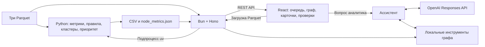

# Moneylai

**Объяснимый анализ транзакционной сети для AML-аналитика.** Moneylai помогает разобраться в графе банковских переводов: кто собирает средства, кто передаёт их дальше, какие группы связаны между собой и кого стоит проверить первым. Для каждого клиента решение показывает роль, приоритет и численное обоснование, которое можно сопоставить с исходными переводами.

Проект создан для кейса HackAlem AI **«Граф денег»**. Встроенный пример — обезличенная выгрузка организаторов: **2 248 клиентов, 3 119 направленных связей, 4 840 переводов, 81 исходный клиент (seed)** за июль 2026 года.

> Роли и приоритеты — гипотезы для аналитической проверки. Структура переводов сама по себе не доказывает причастность клиента к противоправной деятельности.

**Развёрнутая версия:** [moneylai.up.railway.app](https://moneylai.up.railway.app).

[Возможности](#что-реализовано) · [Метод](#как-назначаются-роли-и-приоритет) · [Запуск](#установка-и-запуск) · [Сценарий для жюри](#как-проверить-решение) · [Тесты и эвалы](#тесты-прогоны-и-эвалы) · [Риски](#риски-и-границы-применения)

## Что реализовано

| Возможность | Что получает аналитик |
|---|---|
| Загрузка данных | Три файла Parquet → проверка схемы → расчёт → новая активная выгрузка. Можно переключаться между наборами и удалять загруженные наборы |
| Роли клиентов | Одна из шести ролей по явным правилам: `coordinator`, `consolidator`, `distributor`, `transit`, `terminal`, `peripheral` |
| Очередь проверки | До 30 клиентов по `priority_score`, фильтр по роли, объяснение `why`, переход к карточке клиента |
| Карточка клиента | Значения метрик рядом с порогами правила, суммы и количество переводов, плательщики и получатели, связь с seed, циклы и временные признаки |
| Схема сети | Направленные связи, поиск по полному gid или его окончанию, фильтры, раскраска, масштабирование и выбор узла |
| Группы клиентов | Кластеры, их состав, внутренний оборот, крупнейшие узлы и гипотезы; карта потоков между группами |
| Аналитические проверки | Повторяющиеся цепочки, короткие циклы, активность по дням, синхронные поступления, быстрый вывод, нетипичные входящие суммы, изменение связности при удалении приоритетных узлов |
| Полнота данных | Видимые границы выгрузки и подсказки, какие дополнительные операции запросить |
| Ассистент | Вопрос на русском → вызовы инструментов графа → ответ и видимая цепочка вызовов. Формы поиска путей и общих получателей работают без LLM |
| Экспорт | Три обязательных CSV для жюри и дальнейшего анализа |

Основные экраны: `/`, `/top`, `/nodes/:gid`, `/graph`, `/network`, `/clusters`, `/analysis`, `/assistant`, `/upload`, `/method/rules`, `/method/architecture`. В разделе `/analysis` доступны вкладки `routes`, `time`, `anomalies`, `resilience`, `completeness`.

Реализация интерфейса — [client/src/pages](client/src/pages), вычислений API — [server/src/data](server/src/data), назначения ролей — [pipeline/run.py](pipeline/run.py).

## Как работает решение

1. **Выбрать входные данные.** При запуске открывается демо организаторов. Для своей выгрузки аналитик передаёт `nodes.parquet`, `edges.parquet` и `transactions.parquet` через экран «Данные».
2. **Проверить и рассчитать.** Python-пайплайн сверяет схему и согласованность файлов, строит направленный граф, вычисляет структурные и временные признаки, назначает роли, кластеры и приоритеты.
3. **Получить очередь проверки.** Аналитик открывает приоритетного клиента и видит фактические значения рядом с условиями сработавшего правила.
4. **Проверить контекст.** На схеме и в карточке можно проследить контрагентов, суммы и число переводов; в аналитике — цепочки, циклы, синхронность и границы наблюдения.
5. **Сформировать следующую гипотезу.** Поиск путей и ассистент помогают задавать вопросы к уже рассчитанным данным. Аналитик решает, какие операции или периоды запросить дополнительно, и скачивает CSV.

Повторная загрузка тех же трёх файлов определяется по хешу содержимого и активирует существующий набор без пересчёта. Кнопка обновления интерфейса повторно запрашивает API; расчёт запускается при загрузке нового набора либо отдельной командой пайплайна.

## Данные и результаты

### Вход

Источник демо — файлы организаторов в [task/data](task/data). Описание полей — [task/README.md](task/README.md).

| Файл | Поля | Объём демо |
|---|---|---:|
| `nodes.parquet` | `gid, depth, is_seed` | 2 248 клиентов |
| `edges.parquet` | `src, dst, sum_kzt, n_tx, depth` | 3 119 пар плательщик → получатель |
| `transactions.parquet` | `src, dst, date, sum_kzt` | 4 840 переводов |

Период демо — **1–31 июля 2026 года**, общий объём видимых переводов — **365 890 012,01 ₸**. Граф собран по исходящим переводам от 81 seed на четыре колена, только внутри одного банка и только для сумм **от 5 000 ₸**. Число клиентов по коленам 0–4: **81 / 472 / 462 / 789 / 444**.

`gid` — идентификатор, а не число для арифметики: в TypeScript и JSON он хранится строкой, в Parquet и Python — как `int64`. Это сохраняет точность значений, превышающих `Number.MAX_SAFE_INTEGER`.

Внешнее обогащение клиентских данных не используется. [task/starter](task/starter) содержит исходный пример организаторов; рабочий расчёт выполняет собственный `pipeline/run.py`.

### Выход

Результаты демо сохранены в [out](out) и пересчитываются из исходных Parquet одной командой.

| Файл | Схема | Строк данных в демо, без заголовка |
|---|---|---:|
| [nodes_roles.csv](out/nodes_roles.csv) | `gid, role, role_score, cluster_id, priority_score, evidence` | 2 248 |
| [clusters.csv](out/clusters.csv) | `cluster_id, n_nodes, n_seed, sum_kzt_internal, top_gids, hypothesis` | 91 |
| [top_nodes.csv](out/top_nodes.csv) | `rank, gid, role, priority_score, why` | 30 |

`evidence` содержит численные основания и занимает не более 200 символов. `role_score` и `priority_score` лежат в диапазоне 0–1. В результат включены все клиенты входного набора, в том числе 19 seed без рёбер.

Дополнительно создаются `node_metrics.csv`, `edge_metrics.csv` и `node_metrics.json`. JSON содержит подробные признаки каждого клиента и `_meta`: рассчитанные пороги, веса, распределение ролей, период и параметры выгрузки. Сервер использует этот JSON вместе с `clusters.csv` и `top_nodes.csv`; при скачивании отдаёт три обязательных CSV. Подробная схема — [docs/PIPELINE_CONTRACT.md](docs/PIPELINE_CONTRACT.md).

## Как назначаются роли и приоритет

### Метрики и правила

Роли вычисляются кодом, без LLM. Пайплайн рассчитывает отдельные показатели суммы и количества переводов, числа контрагентов, PageRank, посредничества (`betweenness`), коротких циклов, связи с seed и времени операций. Роль назначается по условиям таблицы ниже; PageRank и количество переводов служат дополнительным контекстом в карточках и объяснениях и не входят в каскад ролей или формулу приоритета.

`pass_through = out_kzt / in_kzt` — отношение видимого выхода к видимому входу. `seed_share` — оценка доли средств от seed в модели пропорционального смешивания потоков. `fast_out_share` — доля исходящей суммы, перед которой был входящий перевод в пределах двух дней; это временной признак, а не сопоставление конкретных денежных единиц.

Правила проверяются **сверху вниз**, назначается первая подходящая роль. Часть порогов определяется перцентилями входных данных с нижней границей; долевые и временные пороги заданы явно. Ниже — значения для встроенной выгрузки, воспроизведённые текущим кодом.

| Порядок | Роль | Условие | Клиентов |
|---|---|---|---:|
| 0 | `peripheral` с `no_data` | Последнее колено без исходящих либо seed без единого ребра: экономическая роль не определяется | 463 |
| 1 | `coordinator` | ≥3 плательщика, ≥3 получателя, посредничество ≥0,00115965; дополнительно цикл длиной ≤5, либо ≥3 seed выше по потоку, либо сам seed с поступлением от другого seed | 24 |
| 2 | `consolidator` | ≥3 плательщика, пропуск <0,3, вход ≥215 000 ₸, доля крупнейшего плательщика <80% | 63 |
| 3 | `distributor` | ≥16 получателей и число получателей ≥3 × число плательщиков | 20 |
| 4 | `transit` | Есть вход и выход, пропуск 0,8–1,2, вход ≥100 000 ₸, быстрый выход ≤2 дней составляет ≥50%; клиент не seed | 20 |
| 5 | `terminal` | Колено 1–3, нет исходящих либо пропуск <0,3, вход ≥215 000 ₸; клиент не seed | 193 |
| 6 | `peripheral` | Остальные узлы: ни одно из перечисленных правил не выполнено | 1 465 |

Итого `peripheral` — 1 928 клиентов, включая 463 случая `no_data`. Последний наблюдаемый hop определяется из данных; для демо 444 узла четвёртого колена не получают роль terminal только из-за отсутствия исходящих.

Источники порогов: число плательщиков — p95; исходящая степень coordinator — p70, distributor — p95; посредничество coordinator — p95 среди узлов с входом и выходом; вход consolidator/terminal — p80; вход transit — p60 с нижней границей 100 000 ₸. Полные условия и формулы — [pipeline/run.py](pipeline/run.py) и [pipeline/RULES.md](pipeline/RULES.md).

### Что означают оценки

**`role_score`** показывает запас выполнения правила. Для назначенной роли используется `0,5 + 0,5 × средний нормированный запас по числовым условиям`. Для обычной периферии оценка зависит от доли выполненных условий ближайшей роли (`nearest_role`). Для `no_data` значение 1 означает уверенность в отсутствии достаточных данных для назначения экономической роли.

**`priority_score`** определяет порядок ручной проверки:

```text
base = mean(
  percentile_rank(seed_money_in),
  percentile_rank(n_seed_upstream),
  percentile_rank(in_kzt; для seed — out_kzt),
  percentile_rank(betweenness)
)
priority_score = base × вес_роли × поправка_на_слабую_связь_с_seed
```

Веса: coordinator — 1,0; consolidator — 0,9; distributor — 0,7; transit — 0,6; terminal — 0,5; peripheral — 0,2; `no_data` — 0,5. Для coordinator, consolidator, distributor и terminal с `seed_share < 10%` устанавливается `weak_seed_link`, приоритет умножается на 0,7, а объяснение допускает легального контрагента. Обе оценки являются техническими показателями правил, а не вероятностью виновности.

### Кластеры

Louvain применяется **к неориентированной проекции** графа: вес пары — сумма переводов в обе стороны, случайное зерно фиксировано (`seed=42`). Для встроенных данных получен 91 кластер, из них 72 содержат более одного узла. Направление сохраняется при расчёте ролей, потоков и путей, но не используется самим Louvain. Принадлежность к одному кластеру означает связанность в наблюдаемой сети, а не установленную принадлежность к одной организации.

## Технологии и архитектура

| Компонент | Технологии и назначение |
|---|---|
| Расчёт | Python ≥3.12, pandas, NumPy, PyArrow, NetworkX, SciPy; окружение и lock-файл — uv |
| API | TypeScript, Bun, Hono; hyparquet читает Parquet, ZSTD распаковывается через `Bun.zstdDecompressSync`; d3-force рассчитывает расположение узлов |
| Интерфейс | React 19, React Router 8, Vite 8, TypeScript 6, Tailwind CSS 4, shadcn/ui на Base UI, Lucide, Sonner, Canvas 2D |
| AI-ассистент | OpenAI Responses API; модель по умолчанию `gpt-5.6-sol`, настраивается через `OPENAI_MODEL` |
| Проверки | pytest, встроенные проверки Python, анализ чувствительности, отдельные скрипты LLM-эвальвации, TypeScript и oxlint |
| Развёртывание | Docker, Railway; Bun workspaces для клиента и сервера |



```text
client/                  интерфейс, маршруты страниц, типизированные запросы API
server/src/routes/       HTTP API: граф, клиенты, результаты, аналитика, наборы, ассистент
server/src/data/          загрузка наборов, реестр, раскладка графа, аналитика, инструменты
pipeline/run.py          полный расчёт из Parquet в CSV/JSON
pipeline/tests/          проверки на небольшом графе с известными ожидаемыми ролями
pipeline/sensitivity.py  изменение порогов и сравнение ролей/топ-20
pipeline/eval/           снимки v1/v3, LLM-эвалы, сырые ответы и журналы расхода
synthetic/               два синтетических набора, генератор, обход и аудит
experiments/             исследовательский notebook probe-0.ipynb
task/data/               неизменяемые входные данные организаторов
out/                     сохранённые результаты для демо
data/datasets/           пользовательские загрузки; каталог исключён из Git
docs/                    контракт данных, методология, требования и схема решения
Dockerfile, railway.json конфигурация развёртывания
```

Пайплайн — единственный компонент, назначающий роли и приоритет. Сервер читает готовые результаты, строит раскладку, аналитику и индексы запросов. `store.ts` держит реестр наборов и один активный набор. При загрузке новые файлы сохраняются в `data/datasets/<id>/raw`, результаты — в `out` внутри того же каталога, после чего набор становится активным.

### API и внешние интеграции

| Метод и путь | Назначение |
|---|---|
| `GET /api/health`, `GET /api/stats` | Проверка сервиса и сводка активного набора |
| `GET /api/graph`, `GET /api/transactions`, `GET /api/nodes/:gid` | Граф, переводы, карточка клиента |
| `GET /api/top`, `GET /api/clusters`, `GET /api/meta` | Приоритеты, кластеры, правила и пороги |
| `GET /api/export/:file` | Один из трёх обязательных CSV |
| `GET /api/analytics/:key` | `time`, `routes`, `anomalies`, `resilience`, `completeness` |
| `GET /api/datasets`, `POST /api/datasets` | Список наборов и загрузка трёх Parquet |
| `POST /api/datasets/:id/activate`, `DELETE /api/datasets/:id` | Переключение и удаление пользовательского набора |
| `GET /api/assistant/status` | Доступность LLM и список инструментов |
| `POST /api/assistant/tools/:name` | Прямой запрос к инструменту без LLM |
| `POST /api/assistant/ask` | Свободный вопрос через OpenAI |

Ассистент может вызывать семь инструментов: `node_metrics`, `neighbors`, `common_successors`, `paths`, `sync_events`, `query_nodes`, `cluster_summary`. Модель получает вопрос и результаты вызовов, формулирует ответ; сохранённые роли и CSV она не изменяет. Код задаёт требование брать числа из инструментов, а UI показывает цепочку вызовов для проверки ответа.

Ключ OpenAI нужен только для свободных вопросов и повторных внешних LLM-эвальваций. Расчёт, экспорт, граф и прямые инструменты работают локально без ключа. Шрифты Unbounded и IBM Plex Sans/Mono подключены через Google Fonts. Подключения к банковской системе и базы данных в текущем приложении нет: источником служат файлы.

## Установка и запуск

### Что требуется

- **Bun** для клиента и API. При подготовке README команды проверены на Bun **1.4.2**; сервер использует Bun API и не запускается как обычное Node.js-приложение.
- **uv** и **Python ≥3.12** для пересчёта и загрузки новых наборов. Проверки ниже выполнены на Python **3.13.13**; Docker-образ устанавливает Python **3.12**.
- Сеть для первоначальной установки зависимостей. Версии зафиксированы в `bun.lock` и `pipeline/uv.lock`.

### Локальный запуск

```bash
git clone https://github.com/BAITC-Hacks/hack-a5bc9531-menelai.git
cd hack-a5bc9531-menelai
bun install --frozen-lockfile
```

Подготовить окружение пайплайна и пересчитать демо **одной командой из корня репозитория**:

```bash
(cd pipeline && uv sync --frozen && uv run python run.py)
```

Команда читает `task/data`, создаёт `out` и в конце выводит `ПРОВЕРКИ: все assert'ы пройдены`, распределение ролей и время. Для просмотра демо уже сохранённых файлов `out` достаточно; повторный запуск позволяет проверить воспроизводимость. Для загрузок через UI `uv` должен быть доступен серверу в `PATH`.

Запустить API и интерфейс:

```bash
bun run dev
```

Открыть [http://localhost:5173](http://localhost:5173). API работает на [http://localhost:3001](http://localhost:3001), Vite проксирует к нему `/api`.

Для свободных вопросов ассистенту создайте корневой `.env` по образцу [.env.example](.env.example) и заполните `OPENAI_API_KEY`; при необходимости задайте `OPENAI_MODEL`. Если `.env` уже существует, редактируйте его без перезаписи. Файл исключён из Git. Без ключа чат отключён, прямые инструменты доступны.

Пересчёт другой выгрузки:

```bash
cd pipeline
uv run python run.py --data /путь/к/parquet --out /путь/для/результатов
```

### Сборка и запуск в одном сервисе

Из корня репозитория:

```bash
bun run build
bun run start
```

Сервер отдаёт `/api` и собранный `client/dist` на [http://localhost:3001](http://localhost:3001), включая переходы по адресам страниц SPA.

| Переменная | Назначение / значение по умолчанию |
|---|---|
| `PORT` | Порт API, `3001` |
| `DATA_DIR` | Исходные Parquet демо, `task/data` |
| `OUT_DIR` | Рассчитанные результаты демо, `out` |
| `DATASETS_DIR` | Каталог загрузок, `data/datasets` |
| `API_PROXY` | Адрес API для Vite при разработке, `http://localhost:3001` |
| `OPENAI_API_KEY` | Серверный ключ для свободных вопросов |
| `OPENAI_MODEL` | Модель ассистента, `gpt-5.6-sol` |

Пути к данным по умолчанию вычисляются относительно файлов сервера. При изменении используйте абсолютные пути. Встроенный набор всегда имеет id `demo`.

## Как проверить решение

### Демонстрация для жюри

1. **Открыть главную.** Выбрать демо и сверить сводку: 2 248 клиентов, 3 119 связей, 4 840 переводов, 81 seed. Скачать три CSV.
2. **Открыть первого клиента очереди — `100000003684369100`.** Роль `coordinator`, приоритет **0,9917**, 24 плательщика и 62 получателя. В карточке сопоставить порог посредничества с фактом и показать оговорку о неполном входе у seed.
3. **Открыть `100000003115284100`.** Роль `consolidator`, приоритет **0,8849**: вход **2 160 500 ₸** от 8 плательщиков, выход **517 000 ₸** двум получателям, пропуск **0,24**, доля крупнейшего плательщика **29%**. Проверить каждое условие правила.
4. **В «Ассистенте» открыть форму поиска путей.** Указать первый gid как источник, второй — как получателя. Среди результатов есть прямое направленное ребро на **193 000 ₸**, **2 перевода**. Этот сценарий не требует OpenAI.
5. **Проверить границу наблюдения — `100000003220685100`.** Это узел четвёртого колена с входом **1 306 000 ₸**. Он помечен `peripheral` с объяснением «нет данных» и запросом исходящих, поскольку обход остановлен на этом колене.
6. **Открыть «Проверки» → «Полнота данных» и «Маршруты и циклы».** Сопоставить гипотезы с охватом данных и циклами. Затем на экране «Данные» загрузить три исходных Parquet, дождаться расчёта и проверить новую активную выгрузку.

### Проверка через API

Команды выполняются из корня при запущенном сервере:

```bash
curl -fsS http://localhost:3001/api/health
# {"ok":true}

curl -fsS http://localhost:3001/api/stats
# nodes=2248, edges=3119, transactions=4840, seeds=81, clusters=91

curl -fsS http://localhost:3001/api/nodes/100000003684369100

curl -fsS http://localhost:3001/api/assistant/tools/paths \
  -H 'Content-Type: application/json' \
  -d '{"src":"100000003684369100","dst":"100000003115284100","max_len":4}'

curl -fsS http://localhost:3001/api/export/nodes_roles.csv -o /tmp/nodes_roles.csv
```

Загрузка и возврат к демо:

```bash
curl -fsS http://localhost:3001/api/datasets \
  -F nodes=@task/data/nodes.parquet \
  -F edges=@task/data/edges.parquet \
  -F transactions=@task/data/transactions.parquet \
  -F name=jury-check

curl -fsS -X POST http://localhost:3001/api/datasets/demo/activate
```

Успешная загрузка возвращает `{ dataset, log }` и активирует набор. `log` содержит последние 40 строк вывода пайплайна. Ошибки входных файлов возвращаются как HTTP 400 с пояснением; без результатов расчёта API ролей, кластеров и аналитики возвращает 503.

## Тесты, прогоны и эвалы

Проверки отвечали на разные вопросы: соблюдается ли контракт выгрузки; правильно ли реализованы правила; повторяется ли расчёт; насколько результат зависит от порогов; понятны ли объяснения; насколько синтетические данные пригодны для дальнейших испытаний. Их результаты не объединяются в одну «оценку точности».

### 1. Полный прогон и проверки контракта

**Зачем.** Проверить путь от исходных Parquet до обязательных артефактов и убедиться, что интерфейс получает согласованные данные.

**Как.** `load()` в [pipeline/run.py](pipeline/run.py) проверяет обязательные файлы и колонки, уникальность клиентов, наличие seed, концы рёбер и совпадение пар и сумм `edges` с агрегированными `transactions`. После расчёта `checks()` проверяет количество и уникальность строк, словарь ролей, диапазоны оценок, длину evidence, принадлежность к кластерам, обработку отсутствующих данных, порядок топа и ссылки между CSV/JSON.

**Что получили.** При повторной проверке текущей версии 23.09.2026 два запуска `run.py` завершились сообщением `ПРОВЕРКИ: все assert'ы пройдены` за **4,3 и 4,5 секунды** по внутреннему таймеру программы. Получены 2 248 строк ролей, 91 кластер и 30 строк приоритета. Установка зависимостей в эти времена не входит.

**Как использовали.** Проверки встроены в обычный запуск, включая загрузку через API: вычисление должно завершиться успешно прежде, чем новый набор будет зарегистрирован и показан пользователю.

### 2. Регрессионные тесты на небольшом графе

**Зачем.** Проверять конкретные экономические паттерны и случаи неполных данных с заранее известным ожидаемым результатом.

**Как.** [pipeline/tests/test_synthetic.py](pipeline/tests/test_synthetic.py) строит искусственный граф на **62 узлах**. Три теста проверяют назначение ролей, признаки паттернов и веса приоритета. В сценариях есть быстрый транзит и похожий на него медленный вывод, сборщик, веер, координатор с циклом, конечный получатель, легальный магазин с аналогичной структурой, доминирующий плательщик, обрезанный узел и изолированный seed.

```bash
(cd pipeline && uv run pytest tests -q)
```

**Что получили.** Повторный запуск при подготовке README: **`3 passed in 1.28s`**. Проверяются, в частности, нулевая seed-доля у изолированного seed, текст «0 вход., 0 исход.», запрос исходящих у обрезанного узла, `max_payer_share`, поправка 0,7 для слабой связи с seed и отдельный вес `no_data`.

**Как использовали.** Эти проверки закрепляют поведение правил и изменения после разбора эвалов. Это регрессионная проверка реализации на сконструированных примерах; она не заменяет оценку на независимо размеченных банковских данных.

### 3. Повторяемость расчёта

**Зачем.** Убедиться, что одна и та же выгрузка и версия кода дают один результат для демонстрации и проверки жюри.

**Как.** Пайплайн дважды запущен в разные временные каталоги; затем сравнили содержимое файлов. Louvain использует фиксированный `seed=42`.

```bash
(cd pipeline && uv run python run.py --out /tmp/moneylai-run-1)
(cd pipeline && uv run python run.py --out /tmp/moneylai-run-2)

for file in nodes_roles.csv clusters.csv top_nodes.csv node_metrics.csv edge_metrics.csv node_metrics.json
do
  cmp "/tmp/moneylai-run-1/$file" "/tmp/moneylai-run-2/$file"
done
```

**Что получили.** Все **шесть файлов совпали побайтно** между двумя прогонами и с текущими файлами `out` в репозитории. `cmp` при совпадении ничего не печатает.

**Как использовали.** Жюри может пересоздать те же артефакты и проверить объяснение любого gid по тем же метрикам. Повторяемость относится к зафиксированным данным, коду и окружению; сама по себе она не доказывает экономическую истинность роли.

### 4. Чувствительность к порогам

**Зачем.** Оценить риск изменения роли или очереди проверки при выборе близкого порога.

**Как.** [pipeline/sensitivity.py](pipeline/sensitivity.py) меняет **15 параметров** по одному в обе стороны на 20%, затем все пороги одновременно в сторону более мягких и более строгих условий. Получается **30 одиночных и 2 совместных варианта**, плюс базовый. Степенные пороги сдвигаются минимум на единицу: переход 3 → 4 плательщика фактически равен +33%, что явно отмечено в отчёте. Метрики графа сохраняются, пересчитываются роли и приоритет.

До прогона заданы критерии: Jaccard состава топ-20 ≥0,80 и не более 2% клиентов со сменой роли в каждом одиночном варианте. Jaccard — размер пересечения списков, делённый на размер их объединения.

```bash
mkdir -p /tmp/moneylai-sensitivity
(cd pipeline && uv run python sensitivity.py --out /tmp/moneylai-sensitivity)
```

**Что получили.** Повторный расчёт совпал с [out/sensitivity.md](out/sensitivity.md) побайтно.

| Изменение | Jaccard топ-20 | Сменили роль |
|---|---:|---:|
| Минимум плательщиков consolidator: 3 → 4 | 0,67 | 32 |
| Минимальный вход terminal: 215 000 → 172 000 ₸ | 1,00 | 49 |
| Все условия мягче | 0,67 | 134 |
| Все условия строже | 0,54 | 102 |

**Как использовали.** Критерий выполнен не для всех одиночных вариантов: выявлен риск на границе consolidator/terminal. При переходе 3 → 4 четыре сборщика становятся terminal и покидают топ-20. Для проверки таких случаев интерфейс показывает факты рядом с порогами, а приоритет следует использовать как очередь ручной проверки. Анализ не устанавливает новые пороги автоматически; базовые правила и сам отчёт доступны для воспроизведения.

### 5. LLM-эвалы: симуляция жюри и проверка объяснений

**Зачем.** Проверить, можно ли защитить роль конкретного клиента числами, найти неоднозначности методологии и подготовить вопросы для демонстрации. Модель выступала критиком решения; назначение ролей оставалось детерминированным.

**Как организовали.** Скрипты [pipeline/eval/jury.py](pipeline/eval/jury.py), [evidence_check.py](pipeline/eval/evidence_check.py) и [llm.py](pipeline/eval/llm.py) используют OpenAI Responses API. В сохранённых журналах вызовов указана **`gpt-5.6-sol`**; код предусматривает резервную `gpt-5.5`. Правила и данные заморожены в [snapshot_v1](pipeline/eval/snapshot_v1) и [snapshot_v3](pipeline/eval/snapshot_v3), ответы и расход сохранены отдельно.

Проводились три задачи:

1. **Критика методологии.** Модель получила правила, разделы ТЗ и сводку данных и сформулировала замечания к порогам, интерпретации неполной выгрузки и доказательности ролей. Этот этап выполнен на v1; в v3 его не повторяли. Оценка «5/10» в исходном ответе — мнение симулированного жюри, а не оценка реального жюри и не метрика классификации.
2. **Защита отдельного gid.** Модель получила карточку: роль, метрики, evidence, крупнейших контрагентов, циклы и синхронные дни; для топа — ещё `why` и ранг. Ответ — «да / частично / нет» на вопрос об обоснованности роли по правилам и числам, альтернативная роль и уточняющий вопрос. Затем вопросы сгруппированы по темам для подготовки защиты.
3. **Проверка evidence по всей выгрузке.** Первый слой — код: наличие цифр, длина ≤200, префикс роли, нежелательные утверждения о виновности и сверка отдельных чисел с метриками. Второй — модель: соответствие правилам, числам и гипотезной формулировке. В каждом прогоне обработано **2 248 строк**, **57 пакетов** максимум по 40 строк, с восемью параллельными исполнителями.

**Выборка защиты.** В v1 взяли топ-30, по пять случайных узлов каждой роли (`random_state=42`) и 12 специальных случаев: обрезанные узлы, изолированные seed, сборщики со слабой seed-связью и terminal с малым числом плательщиков. После удаления пересечений — **66 gid**. В v3 использованы топ-30, по пять случайных на роль и девять случаев `no_data`, `weak_seed_link` и terminal с доминирующим плательщиком — **65 gid** после удаления пересечений.

**Что получили.** Итоги ниже пересчитаны из сохранённых JSON/CSV, включая [sim_results.json](pipeline/eval/sim_results.json) и [sim_results_v3.json](pipeline/eval/sim_results_v3.json).

| Проверка | v1 | v3 |
|---|---:|---:|
| Уникальных gid в защите | 66 | 65 |
| Роль обоснована: «да» | 54 | 65 |
| «Частично» | 12 | 0 |
| «Нет» | 0 | 0 |
| Строк evidence с замечаниями кодовой проверки | 19 | 0 |
| Замечаний модели к evidence | 21 по 21 gid | 1 по 1 gid |

В v1 код нашёл 19 объяснений изолированных seed без чисел. Модель также указала эти строки и два случая округления: отображение пропуска 0,2988 как 0,30 рядом с условием `<0,3` и доли 0,875 как 87%. В v3 осталось одно замечание модели: у `100000007170072100` пропуск 0,995 отображён как 0,99; кодовая проверка допускает такое расхождение в пределах установленной погрешности.

Между выборками v1 и v3 **25 общих gid**. Результат 65/65 означает согласие модели с обоснованиями выбранных узлов по переданным правилам. Это не «100% точность»: выборки различаются, независимой истинной разметки реальных клиентов нет.

**Как использовали замечания.** Связь с доработками зафиксирована в истории Git, в частности в коммите `b74023e` «pipeline v3: правки по симуляции жюри».

| Находка при проверке | Что сделано в коде и объяснениях |
|---|---|
| Порог посредничества coordinator не был виден в evidence | В evidence печатаются численный порог p95 и фактическое значение |
| Несколько плательщиков могли скрывать один доминирующий источник | Для consolidator введено условие `max_payer_share < 0.8`; четыре прежних сборщика с долями крупнейшего плательщика ≥80% перешли в terminal |
| Обрезанные узлы получали вес обычной периферии | Выделен `no_data`, задан вес 0,5 и явный запрос исходящих переводов |
| Изолированный seed имел seed-долю 1 при отсутствии денег | Установлена доля 0; evidence содержит «0 вход., 0 исход.» |
| Структурный паттерн не обязательно связан с seed | В v2 введены `weak_seed_link` и оговорка о возможном легальном контрагенте; в v3 добавлена поправка приоритета ×0,7 |
| Ближайшая роль периферии и role_score требовали уточнения | Формализованы условия, `nearest_role` сохраняется в метриках |
| Округление визуально противоречило строгому порогу | Добавлена дополнительная точность у границ и уточнено отображение процентов |

Поведение доминирующего плательщика, изолированного seed и весов закреплено регрессионными тестами. Между полными снимками v1 и v3 роли изменились у **38 клиентов** — это совокупный эффект изменений, а не результат одной поправки. Предложения модели о неттинге встречных потоков, точной атрибуции средств и дополнительных флагах остаются предложениями, если их нет в текущем коде.

**Контроль самого эксперимента.** Первоначальный запуск задач защиты и evidence смешал карточки v1 с изменёнными в другой сессии правилами v2. Он исключён из содержательных итогов, сохранён в [raw/mismatch_v2rules](pipeline/eval/raw/mismatch_v2rules); последующие запросы читают правила из замороженного снимка. Так результаты привязаны к конкретной версии правил.

Отчёты: [jury_report.md](pipeline/eval/jury_report.md), [jury_report_v3.md](pipeline/eval/jury_report_v3.md), [critique_theses.md](pipeline/eval/critique_theses.md). Сырые ответы — [raw](pipeline/eval/raw) и [raw_v3](pipeline/eval/raw_v3); замечания — `evidence_*_issues*.csv` в том же каталоге.

> Уточнение к архивным текстам: в таблице сравнения `jury_report_v3.md` знаменатель v1 ошибочно указан как 54; исходные результаты содержат 66 gid, доля «частично» — **12/66 = 18,18%**. В `pipeline/README.md` осталась историческая фраза, что v3 не перезапускалась; сохранённые артефакты подтверждают повтор задач защиты и evidence, но не общей критики методологии.

**Расход по журналам.** v1 включает и исключённый запуск. Указанная стоимость рассчитана скриптом при допущении $5/$40 за миллион входных/выходных токенов; это не подтверждённый счёт провайдера. Reasoning уже входит в выходные токены.

| Журнал | Вызовов | Входных токенов | Выходных токенов | Расчётная стоимость |
|---|---:|---:|---:|---:|
| [usage.jsonl](pipeline/eval/usage.jsonl), v1 | 250 | 1 339 718 | 205 270 | $14,91 |
| [usage_v3.jsonl](pipeline/eval/usage_v3.jsonl), v3 | 123 | 870 066 | 99 643 | $8,34 |

**Как воспроизвести.** Для изучения сохранённых ответов достаточно открыть JSON/CSV; ключ и сеть не нужны. Скрипты исторического прогона можно запустить из `pipeline`:

```bash
cd pipeline
EVAL_SNAP=v3 uv run --with openai --with python-dotenv --with tabulate python eval/jury.py sim
EVAL_SNAP=v3 uv run --with openai --with python-dotenv --with tabulate python eval/jury.py agg
EVAL_SNAP=v3 uv run --with openai --with python-dotenv --with tabulate python eval/evidence_check.py
```

Для v1 используется `EVAL_SNAP=v1`; отдельная задача критики — `eval/jury.py critique`. Скрипты требуют `OPENAI_API_KEY` в корневом `.env` даже при использовании сохранённых ответов. При наличии `raw/*.json` или `raw_v3/*.json` ответ берётся из кеша, при отсутствии — выполняется внешний платный запрос. Архивные снимки имеют расширенную схему для эвала: текущий шестиколоночный `out/nodes_roles.csv` не следует подставлять вместо них. При подготовке этого README внешние LLM-запросы не выполнялись.

### 6. Два независимых синтетических набора

**Зачем.** Создать дополнительные миры с известным авторским замыслом и проверить, насколько генераторы воспроизводят структуру наблюдаемой банковской выгрузки. Это отдельный эксперимент над данными, не измерение точности классификатора на реальных клиентах.

**Как.** До генерации зафиксированы [synthetic/SPEC.md](synthetic/SPEC.md), публичный бриф и критерии проверки. По протоколу генераторы не получали реальные транзакции и реализацию пайплайна. Оба мира проходят один [crawl.py](synthetic/crawl.py): фильтр внутрибанковских операций ≥5 000 ₸ за июль, обход исходящих на четыре колена, сохранение seed без рёбер и обрыв исходящих на границе.

| Метод | Как создан мир | Что осталось в наблюдаемой выгрузке |
|---|---|---|
| **A — LLM-журналы** | Семь авторских частей: шесть ячеек и легальная экономика, CSV участников и операций, пояснения замысла | 785 узлов, 2 273 ребра, 3 284 перевода, 69 seed |
| **B — стохастическая агентная модель** | [B_abm/gen.py](synthetic/B_abm/gen.py), фиксированный `seed=7`, случайное поведение участников по архетипам | 2 153 узла, 4 826 рёбер, 8 364 перевода, 87 seed |

**Что проверяли и получили.**

- **Схема и инварианты.** Проверены типы полей, агрегирование переводов в рёбра, сумма/период/направление, отсутствие исходящих у четвёртого колена и пересечений gid с реальными. При повторной проверке сохранённых A и B оба набора прошли `crawl.check`.
- **Сходство распределений.** [profile.py](synthetic/profile.py) сравнивает степени, суммы, повторяемость переводов, активность, компоненты, циклы, временные признаки и статистики KS. В отчёте по 45 свойствам B ближе к реальным данным в 24 случаях, A — в 19, в двух — равенство. При подготовке README профиль пересчитан во временном каталоге и побайтно совпал с [PROFILE.md](synthetic/PROFILE.md).
- **Наблюдаемость авторской роли.** Проверяются отдельные мягкие сигнатуры, а не полный каскад `run.py`. Среди размеченных авторами участников с вовлечённостью `criminal` на коленах 1–3, без seed, сигнатура transit видна у 80% из 45 примеров A и примерно 6% из 16 примеров B; consolidator — у 0% из 6 примеров A и 10% из 10 примеров B. Авторская «должность» и наблюдаемая функция счёта могут различаться: сборщик может почти всё передавать дальше, а вход транзитного счёта может исчезнуть за межбанковской границей.
- **Ручной аудит.** В [REPORT.md](synthetic/REPORT.md) разобрано по пять случайно выбранных размеченных узлов: авторская роль согласована с видимыми деньгами у 3 из 5 в A и 2 из 5 в B. [audit.py](synthetic/audit.py) выводит метрики и сырые переводы выбранных клиентов для такого разбора.

**Как использовали.** Сопоставление показало, для каких дальнейших проверок пригоден каждый набор: A — для разбора смысла роли по журналу и пояснениям автора, B — для изменения масштаба и повторных случайных генераций. Перед расчётом accuracy потребовалась бы отдельная разметка **наблюдаемой функции**, поскольку метка автора описывает также скрытый от банка мир. Синтетические данные не добавляются к демо и не заменяют исходную выгрузку организаторов.

Пересборка сохранённых наборов и профиля из корня, в отдельной рабочей копии, если нужно сохранить текущие артефакты:

```bash
cd synthetic
uv run --project ../pipeline python crawl.py A_llm
(cd B_abm && uv run --project ../../pipeline python gen.py)
uv run --project ../pipeline python crawl.py B_abm
uv run --project ../pipeline python profile.py
uv run --project ../pipeline python audit.py A_llm
uv run --project ../pipeline python audit.py B_abm
```

Для A используются уже сохранённые журналы, новых LLM-вызовов эти команды не делают. Для B сначала восстанавливаются `world_*.csv`, затем выполняется общий обход. Команды перезаписывают соответствующие синтетические Parquet и профиль.

### 7. Проверка приложения при подготовке README

Повторно выполнено на версии `49dfb93` от 23.09.2026; исходные данные и сохранённые результаты не изменялись.

| Команда / проверка | Результат |
|---|---|
| `bun install --frozen-lockfile` | Зависимости установлены |
| `(cd pipeline && uv sync --frozen)` | `Checked 12 packages` |
| `bun run build` | TypeScript клиента и production-сборка завершились успешно |
| `(cd client && bun run lint)` | Код завершения 0, два предупреждения Fast Refresh в `badge.tsx` и `button.tsx` |
| `(cd server && bunx tsc --noEmit -p .)` | Код завершения 0 |
| Тесты, полный расчёт, сравнение файлов и sensitivity | Результаты приведены выше |
| Локальные запросы через `app.request` Hono | 20 GET-маршрутов API/SPA вернули 200; проверены CSV, аналитика, карточка и граф |
| Путь, загрузка, повторная загрузка, переключение, удаление тестовой загрузки | Успешно; пересчёт запущен в отдельном временном каталоге |
| Ожидаемые ответы ошибок | Неизвестный `/api` — 404; вопрос ассистенту без ключа — 503 |

Сборщик Vite сообщил о JavaScript-фрагменте больше 500 kB. Это предупреждение сохранено как ориентир для оценки загрузки интерфейса. Проверка API не является браузерным end-to-end тестом; внешний чат и доступность удалённого развёртывания в эти локальные проверки не входили.

## Риски и границы применения

| Риск | Как учитывать при работе |
|---|---|
| **Неполная видимость переводов** | В демо отсутствуют межбанковские операции, суммы ниже 5 000 ₸, другие месяцы и исходящие за четвёртым коленом. «Деньги остались» означает отсутствие сопоставимого видимого выхода; для проверки нужны дополнительные данные |
| **Заниженный вход у seed** | Seed исключены из правил transit/terminal, в компоненте масштаба их приоритета используется выход. Соотношение входа и выхода seed не следует трактовать как полный денежный баланс |
| **Легальные двойники паттернов** | Магазин, работодатель или семейные переводы могут соответствовать структурной роли. Проверять связь с seed, контрагентов и контекст; `weak_seed_link` снижает приоритет, но не устанавливает правовую оценку |
| **Зависимость от порогов и порядка правил** | На границе consolidator/terminal состав ролей и топа меняется. Использовать таблицу условий и результаты чувствительности; одна назначенная роль не исключает других возможных интерпретаций |
| **Приближённое представление движения денег** | `seed_share` основан на пропорциональном смешивании, быстрый вывод — на временном окне. Нет точной попереводной атрибуции, неттинга возвратов и проверки хронологии каждого цикла; даты не содержат времени суток |
| **Интерпретация кластеров и LLM** | Louvain не учитывает направление, модель может предложить неподтверждённую интерпретацию. Сверять ответ с инструментами и метриками; оценки LLM-эвала не заменяют независимую разметку |
| **Обработка других схем и размеров** | Загрузка принимает три Parquet заданной схемы, суммарно до 100 MiB; одна обработка за раз, тайм-аут пять минут. Период и последний hop читаются из данных, но правило terminal и часть подписей рассчитаны на колена 1–3/4; встроенная проверка требует минимум 20 строк топа |
| **Общий серверный контекст** | Активный набор один для всех пользователей; при перезапуске выбирается demo. Пользовательские наборы хранятся на диске, постоянный том в конфигурации репозитория не объявлен |
| **Использование реальных банковских данных** | В текущем прототипе нет авторизации и разграничения рабочих пространств. При включённом чате вопрос и результаты инструментов передаются внешнему OpenAI API; для чувствительных данных нужно отдельно определить условия доступа и обработки |
| **Рост нагрузки** | Данные и аналитика хранятся в памяти; точное посредничество, перебор циклов и отрисовка всего графа требуют проверки на существенно больших объёмах |

### Масштабирование до примерно миллиона узлов

Текущий замер относится к 2 248 узлам; время работы на миллионе узлов не измерялось. Для такого объёма потребуется перенести агрегации в колоночную обработку, считать приближённое посредничество, ограничивать циклы компонентами и кандидатами, пересчитывать затронутые части графа и отдавать интерфейсу выбранные подграфы. Возможные инструменты для этих изменений — DuckDB/Polars и igraph/graph-tool; **в текущую реализацию они не входят**. Направление развития подробнее описано в [pipeline/README.md](pipeline/README.md).

## Развёртывание

Ссылка на приложение, сохранённая в репозитории: **[https://moneylai.up.railway.app](https://moneylai.up.railway.app)**.

[Dockerfile](Dockerfile) собирает один сервис: Bun, uv, Python 3.12, зависимости пайплайна и production-клиент. Hono отдаёт и API, и интерфейс. [railway.json](railway.json) выбирает Dockerfile и проверку здоровья `/api/health`. Python-окружение собирается заранее, поэтому для пересчёта внутри готового контейнера установка зависимостей не требуется.

Локальный запуск такого образа:

```bash
docker build -t moneylai .
docker run --rm -p 3001:3001 -e PORT=3001 moneylai
```

Для воспроизводимого расчёта и демонстрации через локальный интерфейс облачное развёртывание не требуется.
