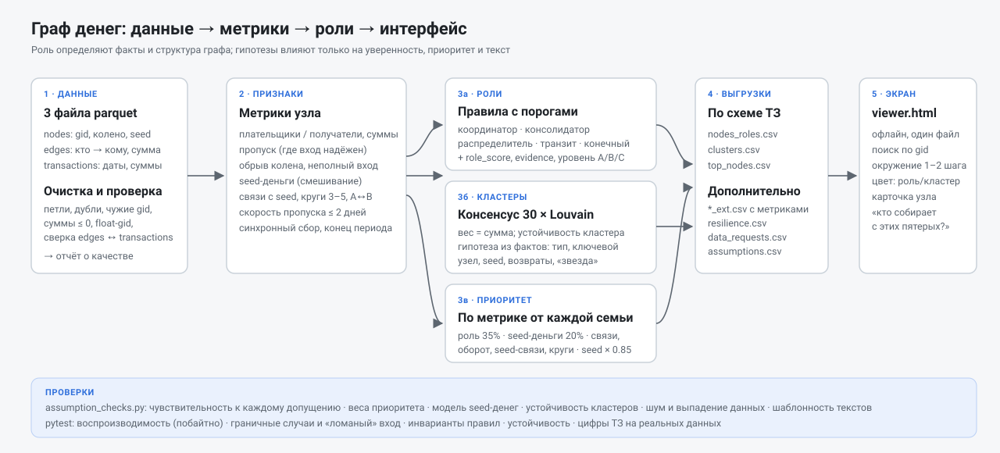

# Граф денег

Инструмент для AML-аналитика. На входе выгрузка переводов от 81 известного клиента (seed) на 4 колена. На выходе:

- роль каждого из 2 248 участников с уверенностью и объяснением;
- кластеры с гипотезами о назначении;
- топ-лист «кого проверять первым и почему»;
- интерактивная схема сети.

Все выводы сформулированы как **гипотезы для проверки**, а не как утверждения о виновности.

Это Python-пайплайн внутри общего репозитория. Как из разведки данных получились эти правила, описано в [docs/ANALYSIS.md](docs/ANALYSIS.md). Разведка данных лежит в [notebooks/eda.ipynb](notebooks/eda.ipynb).



---

## 1. Быстрый старт

Нужен Python 3.9+ с библиотеками из `requirements.txt` (в Anaconda они уже есть, кроме, возможно, `pyarrow`).

```bash
cd graph-money
pip install -r requirements.txt
python pipeline.py --data ../task/data --out output
```

`--data` — папка с `nodes.parquet`, `edges.parquet`, `transactions.parquet`. В репозитории это `../task/data`. Полный пересчёт занимает 10–20 секунд (лимит ТЗ — 5 минут). Команда возвращает код 0, если все проверки выгрузок пройдены.

Windows (Anaconda Prompt), путь с пробелами берётся в кавычки:

```bat
cd "C:\path\to\repo\graph-money"
python pipeline.py --data ..\task\data --out output
```

Дополнительно:

```bash
python pipeline.py --data ../task/data --out output --card <gid>   # карточка узла в консоли
python assumption_checks.py --data ../task/data --out output        # проверки допущений и устойчивости (~1 мин)
python -m pytest                                                    # тесты (~2 мин; реальные данные — ../task/data или GRAPH_DATA)
```

На Windows всё сразу (расчёт, проверки, тесты): `run_all.bat` (по умолчанию данные из `..\task\data`).

Из Jupyter:

```python
import pipeline as pl
R = pl.run("../task/data", "output")
print(pl.node_card(R, R["top"].gid[0]))
```

## 2. Что на выходе (`output/`)

Результаты последнего прогона закоммичены в `output/`. Пересчёт детерминирован: повторный запуск даёт побайтно те же файлы, кроме времени шагов в `run_summary.json`.

| Файл | Содержание |
|---|---|
| `nodes_roles.csv` | **по ТЗ**: `gid, role, role_score, cluster_id, priority_score, evidence`, 2 248 строк |
| `clusters.csv` | **по ТЗ**: `cluster_id, n_nodes, n_seed, sum_kzt_internal, top_gids, hypothesis` |
| `top_nodes.csv` | **по ТЗ**: `rank, gid, role, priority_score, why`, 50 строк |
| `viewer.html` | экран просмотра, работает **офлайн** (библиотека встроена в файл) |
| `*_ext.csv` | те же таблицы с метриками: уровень уверенности (tier), устойчивость роли, объёмы, связи с seed, тип и сила гипотезы кластера, устойчивость кластера |
| `resilience.csv` | устойчивость сети: что будет при изъятии топ-k узлов (опциональный пункт ТЗ) |
| `data_requests.csv` | оценка полноты: каких данных не хватает по конкретным узлам и что запросить (опциональный пункт ТЗ) |
| `assumptions.csv` | реестр всех допущений с текущими значениями и обоснованием |
| `run_summary.json` | сводка прогона: роли, кластеры, замечания к качеству данных, время по шагам |

После `assumption_checks.py` добавляются `assumption_report.csv` (OK / WARN / INFO по каждой проверке), `assumption_sensitivity.csv`, `cluster_stability.csv` и `top_stability.csv`.

### Экран просмотра (`viewer.html`)

- **Поиск по gid** (Enter или двойной клик по узлу) показывает окружение на 1 или 2 шага и карточку узла: роль, уверенность, почему, крупнейшие плательщики и получатели, гипотеза кластера, на что обратить внимание.
- **Виды:** «Топ-50 и связи» (по умолчанию) и «Вся сеть».
- **Раскраска** по роли, кластеру или колену. Звезда — seed, размер — приоритет, стрелка — направление денег, толщина — сумма, светлые узлы — обрыв выгрузки.
- **Запрос по графу.** Несколько gid → «кто получает от них» или «кто им платит» в пределах 3 шагов, с путями на схеме. Это ответ на вопрос «кто собирает деньги с этих пятерых?».

## 3. Как учтены ограничения данных

| Ограничение (из ТЗ) | Что мы делаем |
|---|---|
| Обрыв на 4-м колене: 444 узла без исходящих | `flag_truncated`. Такой узел **никогда** не становится terminal или transit. Консолидатором он стать может (вход виден полностью), но с пониженной уверенностью. Обрыв определяется автоматически: последнее колено считается обрезанным, только если ни у одного его узла нет исходящих |
| Видны только исходящие, вход неполный (354 узла отдают больше, чем получили) | `inflow_reliable`. Отношение «отдал/получил» используется только там, где вход не занижен (не seed и out ≤ in). У остальных транзит определяется по скорости пропуска (уровень C — гипотеза) |
| У seed вход занижен | То же, плюс seed не может быть terminal |
| Порог 5 000 KZT | Дробление ниже порога не ищем. Всё «количественное» (число контрагентов) — нижняя оценка |
| 19 seed вне рёбер, 12 — только получатели | Роль «периферия» с явной пометкой «нет переводов в выгрузке: роль определить нельзя», кластер 0 (служебный) |
| 16 компонент | Кластеры никогда не объединяют разные компоненты (проверяется) |
| Нет атрибутов клиента | Только структура и суммы; ничего не достраиваем |
| Нет разметки | Оцениваем не точность, а устойчивость и непротиворечивость (раздел 8) |
| Один месяц | Вход в последние 3 дня снижает уверенность терминала: деньги могли уйти позже |
| В датах нет времени | «Быстрый пропуск» — в тот же день или в течение 2 дней, порядок внутри дня неизвестен |

Загрузка также чистит данные и пишет, что именно исправлено (`run_summary.json → data_quality`): переводы самому себе, неположительные суммы, gid вне `nodes`, повторные пары, расхождения `edges` и `transactions`, `gid` в формате float (при > 2^53 возможна потеря точности).

## 4. Признаки узла

| Признак | Смысл |
|---|---|
| `in_deg`, `out_deg`, `in_sum`, `out_sum` | число разных плательщиков и получателей, суммы |
| `pass_ratio` | отдал / получил (только при надёжном входе) |
| `volume_dedup` | max(вход, выход): оборот без двойного счёта транзита |
| `n_seed_links`, `in_from_seed_deg` | прямые связи с seed |
| `seed_share`, `seed_money_in` | модель «окрашенных денег»: у seed доля 1, каждый узел передаёт дальше ту же долю, что у него во входе (пропорциональное смешивание); невидимый вход считается «чистым» |
| `in_cycle3`, `n_mutual` | участие в кругах из 3–5 участников; взаимные переводы A↔B (отдельно — у обычных людей они часты) |
| `fast_share` | доля исходящих денег, ушедших в течение 2 дней после входа |
| `max_payers_day` | максимум разных плательщиков за один день (синхронный сбор) |
| `late_last_in` | последний вход в последние 3 дня периода |

## 5. Роли: правила и пороги

Главный принцип: **роль задают факты и структура, гипотезы меняют только уверенность, приоритет и текст.** Если подходят несколько правил, побеждает последнее в порядке terminal → transit → distributor → consolidator → coordinator.

| Роль | Правило | Пороги |
|---|---|---|
| `coordinator` | собирает **и** раздаёт, при этом (8+ плательщиков **или** связь с 2+ seed), и связь с seed-деньгами не слабая | `coord_min_in`=5, `coord_min_out`=10, `coord_strong_in`=8, `coord_min_seed_links`=2 |
| `consolidator` | 5+ разных плательщиков и отдаёт дальше ≤ 50% видимого входа | `cons_min_in`=5, `cons_max_pass`=0.5; уверенность растёт ступенькой до `cons_strong_in`=8 и 16 |
| `distributor` | 10+ разных получателей | `dist_min_out`=10 |
| `transit` | вход надёжен и отдал 80–120% при входе ≥ 100 тыс. **или** (вход не виден) 70%+ исходящих ушло в течение 2 дней — уровень C | `band`=(0.8, 1.2), `min_sum`=100 000, `fast_days`=2, `fast_min`=0.7 |
| `terminal` | нет исходящих, не обрезан, не seed, получил ≥ 100 тыс. | `min_sum` |
| `peripheral` | остальные; отдельно помечены «нет переводов» и «обрыв выгрузки» | — |

**`role_score`** — насколько уверенно сработало правило (0,5 на пороге → 1,0 далеко за ним). Его понижают:

- слабая связь с seed (`weak_seed_share`=0.1, нет прямых связей): × `weak_penalty`=0.75, в evidence — «возможна легальная активность»;
- у терминала: вход в конце периода (`late_days`=3), доля seed-денег ниже `term_seed_share`=0.2;
- у консолидатора на обрезанном колене: × 0,8.

У периферии `role_score` означает уверенность в том, что роли нет: 0,9 у узла с 1–2 мелкими связями, 0,3 при обрыве выгрузки, 0,2 при отсутствии переводов.

**Уровень (`tier`, в `_ext`):** A — артефакт данных (факт), B — правило, C — гипотеза по косвенным признакам.

**Устойчивость роли (`role_stability`, в `_ext`)** — доля из 27 вариантов порогов (±1 шаг по `stability_grid`), при которых роль не меняется.

Синхронный сбор (`sync_min_payers`=3 плательщика в день) повышает уверенность консолидатора и упоминается в evidence.

## 6. Приоритет (`priority_score`)

По одной метрике от каждой «семьи» признаков, чтобы одно и то же не учитывалось дважды (корреляции проверяются):

```
priority = 0.35·роль + 0.20·seed-деньги + 0.10·плательщики + 0.10·получатели
         + 0.10·оборот + 0.10·связи с seed + 0.05·круги      (веса — prio_w)
роль = вес роли (role_w) × role_score;  остальное — перцентили 0..1
seed: priority × seed_factor (0.85) — они уже известны, фокус на новых узлах
```

Иерархия ролей `role_w`: coordinator 1,0 → consolidator 0,9 → distributor 0,8 → transit 0,7 → terminal 0,5 → peripheral 0,1. Логика такая: чем ближе узел к управлению деньгами, тем выше. Консолидатор почти равен координатору, потому что ТЗ ставит фокус именно на точки консолидации. Проверки показывают, что при равных весах активных ролей топ-20 меняется слабо (блок B3).

**`top_nodes.csv`**: топ-`top_n`=50 по приоритету (при равенстве — по `role_score`, затем по gid). В `why` — evidence, конкретные причины приоритета, устойчивость роли и кластер. Если связь с seed не подтверждена, это сказано прямо.

## 7. Кластеры

- **Метод:** консенсус `cl_runs`=30 запусков Louvain (`cl_seed0`=0) на неориентированном графе с весом = сумма переводов (`cl_weight`="w", `cl_resolution`=1.0). Два узла в одном кластере, если они вместе минимум в `cl_thr`=80% запусков. Узел без ядра присоединяется к соседу при согласии ≥ `cl_attach`=0.5. Так разбиение не зависит от случайности (ARI между независимыми консенсусами ≈ 0,99).
- **Почему вес — сумма:** кластер — это группа, между которой ходят крупные деньги, а не много мелких связей. Это осознанный выбор. С весом «логарифм суммы» или без весов границы получаются другими (проверка A2), но число групп с несколькими seed почти не меняется.
- **Устойчивость каждого кластера** (`cl_stability`) — средний Jaccard с лучшим совпадением в 5 вариантах: другая случайность, порог 0,7/0,9, resolution 0,5/2,0. Ниже `cl_stable_min`=0.6 в гипотезе появляется «границы группы неустойчивы», и сила гипотезы понижается.
- **Кластер 0** — служебный: узлы без переводов.
- **Гипотеза** (`hypothesis`) строится из фактов кластера: тип, ключевой узел, суммы, число seed. Плюс уточнения: «звезда», круги, возвратные потоки (≥ `back_flow_share`=40% оборота идёт назад по коленам), доля seed-оборота, обрыв выгрузки, слабая связь ключевого узла.

| Тип (`cluster_type`) | Условие | Пример формулировки |
|---|---|---|
| core | есть координатор | возможное ядро: узел X собирает от N плательщиков и раздаёт M получателям |
| collection | есть консолидатор и связь с seed | возможный сбор средств: узел X получил S от N плательщиков (из них seed: k) |
| fan_out | есть распределитель | веерная раздача: узел X отправил S M получателям |
| transit_chain | есть транзит | возможная транзитная цепочка через узел X |
| seed_periphery | только seed и периферия | окружение seed X: N узлов, разовые переводы |
| periphery | ролей нет | группа вокруг узла X: N узлов, оборот S |
| fragment | ≤ 3 узлов | малый фрагмент: основной перевод A → B на S |

Сила гипотезы (`hypothesis_strength` в `_ext`): сильная, умеренная или слабая.

## 8. Проверки и тесты

### `assumption_checks.py` — «что будет, если наше допущение неверно»

| Блок | Что проверяется |
|---|---|
| A. Кластеры | случайность консенсуса; порог согласия, вес, resolution; устойчивость каждого кластера; модулярность консенсуса против одиночного Louvain; доля оборота внутри кластеров; нет кластеров через разные компоненты |
| B. Топ | каждый вес приоритета ×0,5/×1,5/убрать; 500 случайных наборов весов (устойчивое ядро и хрупкий хвост); иерархия ролей; три модели seed-денег; `seed_factor`; исключение по одному seed; перекосы по коленам и кластерам; дубли признаков; граница топа |
| D. Реестр допущений | у каждого параметра есть тип и обоснование; чувствительность ролей и топа к **каждому** порогу и гипотезе; какие гипотезы сильно влияют на результат |
| E. Данные | шум в суммах ±5% и ±10%; выпадение 5% связей |
| T. Тексты | уникальность и конкретность гипотез; доля «слабых» гипотез; утверждения в текстах сверяются с данными; однотипность обоснований в топе |
| C. Общее | хардкод gid; время; схема; повторный запуск; перемешанные строки входа дают побайтно те же CSV |

### `pytest` (88 тестов)

- **Работоспособность:** все файлы и схемы, CLI, карточка, офлайн-просмотрщик (без внешних скриптов, gid — строки: 18 цифр не помещаются в число JavaScript), просмотрщик в настоящем браузере (если установлен playwright).
- **Воспроизводимость:** два запуска и перемешанные входные строки дают побайтно одинаковые файлы; лишние колонки игнорируются; номера кластеров канонические.
- **Граничные случаи:** только seed без переводов; одно ребро; петли, дубли, чужие gid; нулевые, отрицательные и пустые суммы; gid как float; is_seed строками; отсутствующие колонки и файлы; пустые транзакции; даты строками и мусором; веер на 150 получателей; круг; взаимная пара; маленький граф (топ < 20).
- **Инварианты правил** на синтетике и реальных данных: ни один узел не противоречит своей роли.
- **Устойчивость:** шум, выпадение связей, сдвиг порогов, исключение одного seed.
- **Тексты:** склонения, числа в текстах равны данным, нет обвинительных формулировок, гипотезы не повторяются.
- **Документация:** каждый параметр описан в реестре и в этом README; нет хардкода gid.
- **Реальные данные** (если найдены): все цифры из раздела «Данные» ТЗ (2 248 / 81 / 3 119 / 4 840, колена, оборот 365 890 012, 444 обрезанных, 31 и 19 seed, 16 компонент), все роли присутствуют, время < 5 минут.

## 9. Реестр допущений (полный список — `assumptions.csv`)

Типы: **порог** — числовая граница правила; **гипотеза** — предположение о поведении денег или людей; **методика** — выбор метода; **продукт** — решение о том, что показывать аналитику.

| Параметр | Тип | Значение и обоснование |
|---|---|---|
| `cons_min_in`, `cons_strong_in`, `cons_max_pass` | порог | 5 / 8 плательщиков, ≤ 50% дальше; 8 — ориентир ТЗ (8–24) и плато чувствительности |
| `dist_min_out` | порог | 10 получателей; сильные случаи ТЗ — 60–116 |
| `band`, `min_sum` | порог | пропуск 0,8–1,2 (ориентир ТЗ); 100 тыс. = 20× порога выгрузки |
| `coord_min_in`, `coord_min_out`, `coord_strong_in`, `coord_min_seed_links` | порог | 5 и 10, плюс 8 плательщиков или 2 seed |
| `sync_min_payers`, `back_flow_share`, `cl_stable_min` | порог | 3 плательщика в день; 40% оборота назад; устойчивость 0,6 |
| `fast_days`, `fast_min`, `late_days` | гипотеза | «сквозной транзит» 1–2 дня (ТЗ); 70%; конец периода — 3 дня |
| `weak_seed_share`, `term_seed_share`, `weak_penalty` | гипотеза | связь с seed слабая при < 10% seed-денег; терминал уверенный от 20%; штраф 0,75 |
| `seed_denom` | гипотеза | пропорциональное смешивание, невидимый вход «чистый» (осторожно) |
| `cl_weight` | гипотеза | кластер = группа с крупными суммами между участниками |
| `role_w`, `prio_w`, `seed_factor`, `top_n` | продукт | иерархия ролей, веса семей признаков, seed × 0,85, топ-50 |
| `cl_runs`, `cl_thr`, `cl_attach`, `cl_seed0`, `cl_resolution`, `cl_stability` | методика | консенсус 30 запусков, согласие 80%, фиксированная случайность |
| `max_cycle_len`, `stability_grid`, `resilience_k`, `resilience_random` | методика | круги до 5 шагов (глубина обхода 4); сетка ±1 шаг; изъятие 5/10/20/50 узлов, 20 случайных повторов |

**Где результат сильнее всего зависит от допущений** (по `assumption_checks.py` на предоставленных данных):

1. **Модель seed-денег (`seed_denom`).** При «агрессивной» модели топ-20 заметно меняется. Это главное аналитическое допущение. Роли от него не зависят, только приоритет.
2. **Вес рёбер в кластеризации (`cl_weight`).** Границы кластеров зависят от выбора «сумма / логарифм / без веса». Число групп с несколькими seed — нет.
3. **`min_sum`.** От него почти целиком зависит число терминалов (при 50 тыс. — около 500, при 100 тыс. — около 320). Поэтому у терминалов самая низкая уверенность и самый низкий вес в приоритете.

## 10. Ограничения подхода

- «Конечный получатель» — только в пределах выгрузки: деньги могли уйти в другой банк, наличными или в следующем месяце.
- Большой оборот ≠ участие в схеме. Узел без связи с seed-деньгами может быть магазином или работодателем. Такие узлы помечены, но не исключены.
- Консолидатор может быть легальным хабом (продавцом): ТЗ не даёт атрибутов, чтобы это различить.
- Модель seed-денег предполагает пропорциональное смешивание. Другие модели (FIFO, «грязные уходят первыми») дали бы другой приоритет.
- Louvain не видит направление денег. Направление учитывается в ролях и в тексте гипотез (возвратные потоки, звезда).
- Устойчивость ≠ правильность. Проверки доказывают, что результат не разваливается от наших решений, а не что он верен: разметки нет.

## 11. Масштабирование до ~1 млн узлов

| Шаг | Сейчас | При ~1 млн узлов / ~10 млн переводов |
|---|---|---|
| Хранение и агрегаты | pandas | DuckDB / Polars по parquet (агрегаты — SQL `GROUP BY`, потоково) |
| Граф | networkx | igraph / rustworkx (C/Rust), разреженные матрицы scipy |
| Seed-деньги | итерации на numpy | то же как умножение разреженной матрицы на вектор: O(рёбер) за итерацию, ~20 итераций |
| Круги | перебор до 5 шагов | перебор экспоненциален → только 3–4-циклы через разреженные произведения матриц и только в окрестности кандидатов (топ-N и seed) |
| Кластеры | консенсус 30 × Louvain | Leiden (leidenalg / igraph), 5–10 запусков параллельно; консенсус только внутри крупных компонент |
| Пороги | абсолютные (5 плательщиков) | калибровка по перцентилям в сегменте (колено, компонента): абсолютные пороги на большом графе дадут тысячи «консолидаторов» |
| Устойчивость ролей | 27 вариантов порогов | векторизовано, линейно по узлам — без изменений |
| Экран | весь граф в браузере | в браузере только топ-N и окружение по запросу; сервер отдаёт подграф из DuckDB; вся сеть — агрегированная карта кластеров |
| Обновление | батч за период | инкрементально: пересчёт компонент, затронутых новыми переводами |

## 12. Демо (5 минут)

1. `python pipeline.py --data ../task/data --out output` — живой прогон, 10–20 с, все проверки OK.
2. Открыть `viewer.html` → вид «Топ-50»: цвета ролей, звёзды-seed.
3. Разбор 2–3 узлов: gid → Enter → карточка. Причина роли — в evidence; «почему роль такая» — таблица правил из раздела 5.
4. Запрос по графу: 3–5 seed → «Кто получает от них» → общие получатели и пути.
5. `resilience.csv`: изъятие топ-20 по приоритету против случайных 20 узлов — насколько сильнее рвётся сеть.
6. `data_requests.csv`: что запросить дальше.

## 13. Структура репозитория

```
pipeline.py            расчёт: загрузка → признаки → кластеры → роли → приоритет → выгрузки
viewer.py              экран просмотра (один офлайн HTML)
assumption_checks.py   проверки допущений, устойчивости, воспроизводимости
synth.py               генератор синтетических данных той же формы (для тестов)
run_all.bat            Windows: расчёт + проверки + тесты одной командой
assets/                vis-network 9.1.2 (Apache-2.0 / MIT) — встраивается в viewer.html
docs/scheme.svg        схема решения (+ scheme.png)
docs/ANALYSIS.md       как из разведки данных получились правила; итоги проверок
notebooks/eda.ipynb    разведка данных: 12 проверок гипотез о данных, версии правил v1–v4
output/                результаты последнего прогона
tests/                 pytest
```
